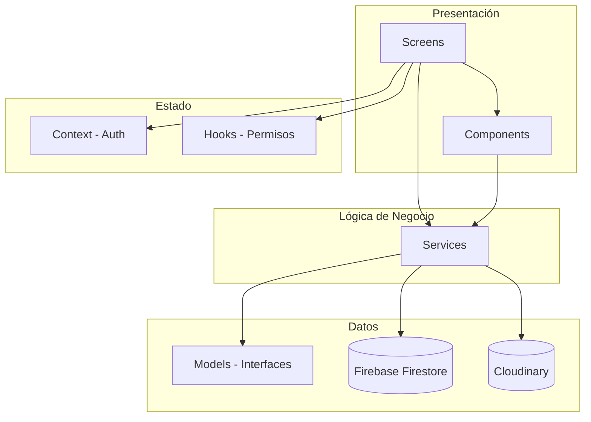
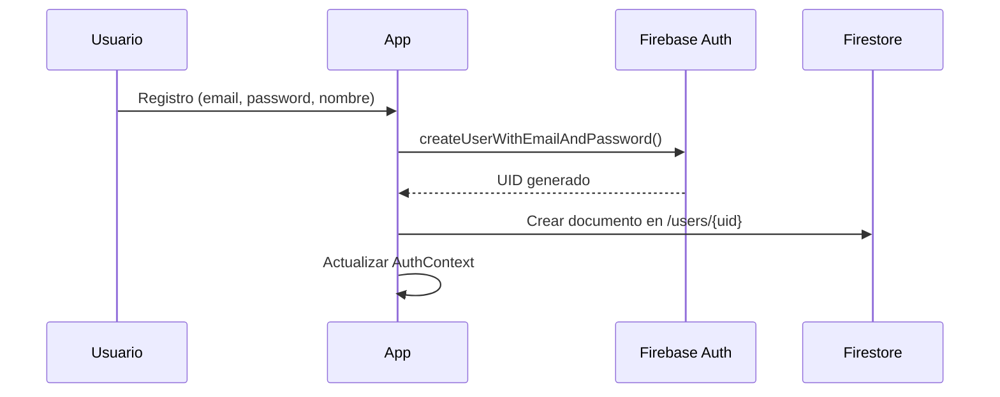
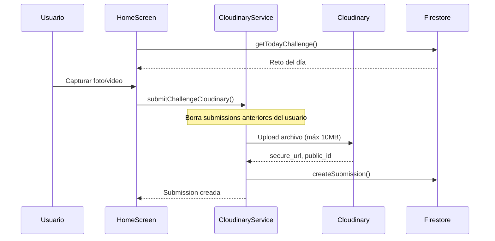

# 📱 Challenge Meeting - Análisis del Proyecto

## Descripción General

**Challenge Meeting** es una aplicación móvil desarrollada con **React Native/Expo** que permite a los usuarios participar en retos diarios, subir pruebas de sus logros (fotos/videos), y competir con amigos a través de un sistema de votación y comentarios.

---

## 🛠️ Stack Tecnológico

| Categoría | Tecnología | Versión |
|-----------|------------|---------|
| **Framework** | React Native + Expo | 54.0.31 |
| **Lenguaje** | TypeScript | ~5.9.2 |
| **Backend (BaaS)** | Firebase | 12.7.0 |
| **Navegación** | React Navigation | 7.x |
| **Almacenamiento Multimedia** | Cloudinary | - |
| **UI Patterns** | Custom Components + StyleSheet | - |

### Dependencias Clave
- `@react-navigation/native-stack` y `@react-navigation/bottom-tabs` - Navegación
- `expo-image-picker` - Captura de fotos/videos
- `expo-av` - Reproducción de videos
- `firebase` (Auth, Firestore, Storage) - Backend
- `expo-crypto` - Generación de firmas para Cloudinary

---

## 📁 Estructura del Proyecto

```
challenge-meeting/
├── App.tsx                    # Punto de entrada principal
├── firebase-config.ts         # Configuración Firebase
├── src/
│   ├── components/            # Componentes reutilizables UI
│   │   ├── app-button.tsx
│   │   ├── app-input.tsx
│   │   └── challenge-card.tsx # Tarjeta de submission con votos/comentarios
│   ├── context/
│   │   └── auth-context.tsx   # Contexto de autenticación global
│   ├── hooks/
│   │   └── use-camara-permission.ts
│   ├── models/                # Interfaces TypeScript
│   │   ├── user.ts
│   │   ├── daily-challenge.ts
│   │   ├── submission.ts
│   │   ├── friendship.ts
│   │   ├── comment.ts
│   │   └── vote.ts
│   ├── navigation/
│   │   └── app-navigator.tsx  # Navegación principal (auth vs main)
│   ├── screens/               # Pantallas de la app
│   │   ├── bottom-tabs.tsx
│   │   ├── home-screen.tsx
│   │   ├── login-screen.tsx
│   │   ├── profile-screen.tsx
│   │   ├── friends-screen.tsx
│   │   └── ...
│   ├── services/              # Lógica de negocio y Firebase
│   │   ├── auth.service.ts
│   │   ├── challenge.service.ts
│   │   ├── submissions.service.ts
│   │   ├── friends.service.ts
│   │   ├── cloudinary.service.ts
│   │   └── ...
│   └── styles/
│       └── theme.ts           # Constantes de diseño (colores, spacing)
```

---

## 🏗️ Arquitectura de la Aplicación

La aplicación sigue una **arquitectura por capas** clara:



---

## 📊 Modelos de Datos

### User
```typescript
interface user {
  id: string;
  displayName: string;
  email: string;
  photoURL?: string | null;
  createdAt: Date;
  streak: number;           // Racha de días consecutivos
  totalCompleted: number;   // Retos completados
  totalFailed: number;      // Retos fallidos
  friendsCount: number;
}
```

### Daily Challenge
```typescript
interface dailyChallenge {
  id: string;              // Formato: YYYY-MM-DD
  title: string;
  description: string;
  startsAt: Date;
  endsAt: Date;
  isActive: boolean;
}
```

### Submission
```typescript
interface submission {
  id: string;
  userId: string;
  challengeId: string;
  userName: string;
  userImage?: string | null;
  mediaUrl: string;         // URL en Cloudinary
  mediaType: 'image' | 'video';
  votesUp: number;
  votesDown: number;
  result: 'pending' | 'approved' | 'failed';
  visibility: 'public' | 'friends';
  createdAt: Date;
  public_id: string;        // ID en Cloudinary para borrado
}
```

### Friendship
```typescript
interface friendship {
  id: string;
  user1: string;            // ID del usuario que inicia
  user2: string;            // ID del usuario destino
  status: 'pending' | 'accepted';
  actionBy: string;         // Quién realizó la última acción
  createdAt: Date;
}
```

---

## 🔑 Flujos Principales

### 1. Autenticación


**Implementación:**
- `auth.service.ts` → `register()`, `login()`, `logout()`
- `auth-context.tsx` → Maneja estado global del usuario con `onAuthStateChanged`

### 2. Reto Diario y Submissions



**Características:**
- Límite de **10MB** por archivo
- Automáticamente **elimina submissions anteriores** del usuario
- Al eliminar, también borra:
  - El archivo de Cloudinary (usando firma SHA1)
  - Los comentarios asociados en Firestore

### 3. Sistema de Amistades

| Función | Descripción |
|---------|-------------|
| `sendFriendRequest()` | Crea friendship con status `pending` |
| `acceptFriendRequest()` | Cambia status a `accepted` |
| `rejectFriendRequest()` | Elimina el documento friendship |
| `getFriends()` | Obtiene lista de amigos aceptados |
| `getPendingRequests()` | Solicitudes pendientes recibidas |
| `getFriendshipStatus()` | Retorna: `none`, `pending`, `sent`, `friends` |

---

## 🎨 Sistema de Diseño

La app utiliza un **tema oscuro** definido en `theme.ts`:

```typescript
export const COLORS = {
  background: '#0f0f0f',    // Negro profundo
  card: '#1a1a1a',          // Gris oscuro para tarjetas
  textPrimary: '#ffffff',   // Blanco
  textSecondary: '#aaaaaa', // Gris
  accent: '#6CFF8E',        // Verde neón (acciones positivas)
  danger: '#FF5C5C',        // Rojo (acciones negativas)
};

export const SPACING = { s: 8, m: 16, l: 24, xl: 32, xxl: 40 };
export const RADIUS = { m: 12, l: 16 };
```

---

## 🧭 Navegación

La app utiliza dos niveles de navegación:

### Nivel 1: Stack Principal (AppNavigator)
- **Sin autenticar:** `LoginScreen`
- **Autenticado:** `BottomTabs`, `UserProfile`

### Nivel 2: Bottom Tabs
| Tab | Pantalla | Descripción |
|-----|----------|-------------|
| 🏠 Home | `HomeScreen` | Reto del día + tu submission |
| 👥 Friends | `FriendsScreen` | Lista de amigos |
| 👤 Profile | `ProfileStack` | Tu perfil + navegación anidada |

### Nivel 3: Profile Stack (anidado)
- `ProfileScreen` → Perfil propio
- `UserProfileScreen` → Perfil de otro usuario
- `SearchUsersScreen` → Buscar usuarios
- `SearchFriendsScreen` → Buscar entre amigos
- `FriendsRequestScreen` → Solicitudes pendientes

---

## 🔧 Servicios Detallados

### auth.service.ts
| Función | Descripción |
|---------|-------------|
| `register()` | Crea cuenta + documento usuario en Firestore |
| `login()` | Inicia sesión con email/password |
| `logout()` | Cierra sesión |

### challenge.service.ts
| Función | Descripción |
|---------|-------------|
| `getTodayChallenge()` | Obtiene reto del día (ID = YYYY-MM-DD) |

### admin.service.ts
| Función | Descripción |
|---------|-------------|
| `createTodayChallengeIfNotExists()` | Crea reto diario automáticamente al iniciar la app |

### submissions.service.ts
| Función | Descripción |
|---------|-------------|
| `createSubmission()` | Crea nueva submission |
| `getSubmissionByUserAndChallenge()` | Obtiene submission del usuario para un reto |
| `getSubmissionsByChallenge()` | Obtiene todas las submissions de un reto (excluyendo propias) |

### cloudinary.service.ts
| Función | Descripción |
|---------|-------------|
| `submitChallengeCloudinary()` | Sube archivo a Cloudinary, borra anterior, crea submission |

### friends.service.ts
| Función | Descripción |
|---------|-------------|
| `sendFriendRequest()` | Envía solicitud de amistad |
| `acceptFriendRequest()` | Acepta solicitud |
| `rejectFriendRequest()` | Rechaza/elimina solicitud |
| `getFriends()` | Lista de amigos del usuario |
| `getPendingRequests()` | Solicitudes pendientes recibidas |
| `getFriendshipStatus()` | Estado de la relación entre dos usuarios |
| `getFriendshipId()` | ID del documento de friendship |

### votes.service.ts
| Función | Descripción |
|---------|-------------|
| `voteSubmission()` | Registra voto (+1 o -1) en subcolección |

### comments.service.ts
| Función | Descripción |
|---------|-------------|
| `getCommentsBySubmission()` | Lista comentarios de una submission |
| `createComment()` | Crea nuevo comentario |

### users.service.ts
| Función | Descripción |
|---------|-------------|
| `getUserById()` | Obtiene datos de un usuario |
| `searchUsers()` | Busca usuarios por displayName |
| `createUser()` | Crea documento de usuario |
| `updateUserProfile()` | Actualiza nombre o foto de perfil |

---

## 📱 Componentes Principales

### ChallengeCard
El componente más complejo de la app. Muestra:
- Avatar y nombre del usuario
- Imagen o video de la submission (usando `expo-av` para videos)
- Botones de voto (✔️ / ✖️) con contadores
- Sistema de comentarios expandible
- Input para agregar nuevos comentarios

### useCameraPermission
Hook personalizado que:
- Verifica permisos de cámara al montar
- Provee función para solicitar permisos
- Retorna estado `granted` (boolean)

---

## 🗄️ Estructura de Firebase

### Firestore Collections

```
/users/{userId}
  - displayName, email, photoURL, streak, totalCompleted, ...

/dailyChallenges/{YYYY-MM-DD}
  - title, description, startsAt, endsAt, isActive

/submissions/{submissionId}
  - userId, challengeId, mediaUrl, mediaType, votesUp, votesDown, ...
  └── /votes/{voterId}
      - userId, value (+1 o -1)

/friendships/{friendshipId}
  - user1, user2, status, actionBy, createdAt

/comments/{commentId}
  - submissionId, userId, userName, photoUrl, text, createdAt
```

---

## ⚡ Puntos a Considerar

### Fortalezas
1. **Arquitectura limpia** - Separación clara entre capas
2. **TypeScript** - Tipado fuerte en toda la app
3. **Gestión automática de recursos** - Borra archivos anteriores al subir nuevos
4. **Limite de tamaño** - Previene uploads excesivos (10MB máx)

### Áreas de Mejora Potencial
1. **Countdown hardcodeado** - El timer `19:55:10 left` está fijo, debería calcularse dinámicamente
2. **API keys expuestas** - Las credenciales de Cloudinary están en el código fuente
3. **Sin caché** - Cada navegación recarga datos de Firebase
4. **Sin validación offline** - La app requiere conexión constante
5. **Votación incompleta** - El servicio de votos existe pero no se integra en la UI para actualizar contadores

---

## 🚀 Cómo Ejecutar

```bash
# Instalar dependencias
npm install

# Iniciar en modo desarrollo
npx expo start

# Opciones de ejecución
# - Presiona 'i' para iOS Simulator
# - Presiona 'a' para Android Emulator
# - Escanea QR con Expo Go
```

---

## 📋 Resumen Ejecutivo

**Challenge Meeting** es una aplicación social móvil tipo "BeReal meets daily challenges" donde:

1. **Cada día** se genera un nuevo reto
2. **Los usuarios** capturan foto/video como prueba
3. **La comunidad** vota y comenta las submissions
4. **El sistema de amigos** permite filtrar contenido
5. **Los streaks y estadísticas** incentivan la participación continua

La arquitectura es sólida, con buena separación de responsabilidades, aunque hay espacio para mejoras en aspectos como seguridad de credenciales y funcionalidad offline.
