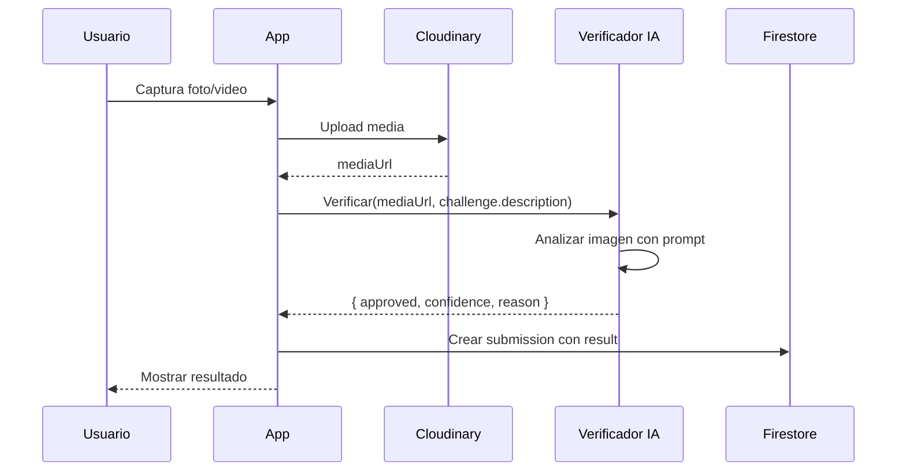

# 🤖 Sistema de Verificación Automática de Retos con IA

## Resumen

Implementar un **agente de visión por IA** que analice las fotos/videos subidos por los usuarios y determine automáticamente si han completado el reto del día.

---

## 🎯 Objetivo

```
Usuario sube foto → IA analiza → ¿Cumple el reto? → Aprobado/Rechazado
```

**Ejemplo:**
- Reto: "Bebe un vaso de agua"
- Usuario sube foto bebiendo agua
- IA responde: `{ "approved": true, "confidence": 0.92, "reason": "Se observa persona bebiendo de un vaso" }`

---

## 🔍 Opciones de APIs de Visión

| Proveedor | Modelo | Precio aprox. | Ventajas | Desventajas |
|-----------|--------|---------------|----------|-------------|
| **OpenAI** | GPT-4 Vision | ~$0.01-0.03/imagen | Excelente comprensión, fácil integración | Requiere cuenta de pago |
| **Google** | Gemini 1.5 Flash | Gratis (límites) | Gratuito para bajo volumen, rápido | Menos preciso que Pro |
| **Google** | Gemini 1.5 Pro | ~$0.00125/imagen | Muy preciso, multimodal | Más caro |
| **Anthropic** | Claude 3 Haiku | ~$0.00025/imagen | Muy barato, bueno | API menos madura |
| **Cloudflare** | Workers AI | Gratis (100k/día) | Gratis, ya usas Cloudinary | Modelos más limitados |

### ✅ Recomendación: **Gemini 1.5 Flash**
- **Gratis** hasta 15 RPM (requests per minute)
- Suficiente para una app en desarrollo
- Fácil migrar a Pro si necesitan más precisión
- Ya tienen Firebase, la integración es natural

---

## 📐 Arquitectura Propuesta



### Dos opciones de implementación:

#### Opción A: Cliente directo (más simple)
```
App → API de IA → Firestore
```
- La app llama directamente a Gemini
- Más simple pero expone API key en el cliente

#### Opción B: Cloud Function (recomendado)
```
App → Cloud Function → API de IA → Firestore
```
- Firebase Cloud Function como intermediario
- API key segura en el servidor
- Permite lógica adicional (rate limiting, logs, etc.)

---

## 💻 Implementación Detallada

### Paso 1: Configurar Gemini API

1. Ir a [Google AI Studio](https://aistudio.google.com/)
2. Crear API Key
3. Guardar en Firebase como secret o variable de entorno

### Paso 2: Crear Cloud Function

```typescript
// functions/src/verifyChallenge.ts
import * as functions from 'firebase-functions';
import { GoogleGenerativeAI } from '@google/generative-ai';

const genAI = new GoogleGenerativeAI(process.env.GEMINI_API_KEY!);

interface VerificationResult {
  approved: boolean;
  confidence: number;
  reason: string;
}

export const verifyChallenge = functions.https.onCall(async (data, context) => {
  // Verificar autenticación
  if (!context.auth) {
    throw new functions.https.HttpsError('unauthenticated', 'Usuario no autenticado');
  }

  const { imageUrl, challengeTitle, challengeDescription } = data;

  const model = genAI.getGenerativeModel({ model: 'gemini-1.5-flash' });

  const prompt = `
Eres un juez de retos diarios. Analiza esta imagen y determina si el usuario ha completado el reto.

RETO: ${challengeTitle}
DESCRIPCIÓN: ${challengeDescription}

INSTRUCCIONES:
1. Analiza la imagen cuidadosamente
2. Determina si muestra evidencia de que el reto fue completado
3. Sé razonablemente flexible pero no aceptes trampas obvias

Responde ÚNICAMENTE con un JSON válido en este formato:
{
  "approved": true/false,
  "confidence": 0.0-1.0,
  "reason": "Explicación breve de tu decisión"
}
`;

  try {
    // Obtener imagen desde URL
    const imageResponse = await fetch(imageUrl);
    const imageBuffer = await imageResponse.arrayBuffer();
    const base64Image = Buffer.from(imageBuffer).toString('base64');
    
    const imagePart = {
      inlineData: {
        data: base64Image,
        mimeType: 'image/jpeg'
      }
    };

    const result = await model.generateContent([prompt, imagePart]);
    const response = result.response.text();
    
    // Parsear JSON de la respuesta
    const jsonMatch = response.match(/\{[\s\S]*\}/);
    if (!jsonMatch) {
      throw new Error('Respuesta inválida del modelo');
    }
    
    const verification: VerificationResult = JSON.parse(jsonMatch[0]);
    
    return verification;
  } catch (error) {
    console.error('Error en verificación:', error);
    // En caso de error, marcar como pendiente para revisión manual
    return {
      approved: false,
      confidence: 0,
      reason: 'Error en verificación automática. Pendiente de revisión manual.'
    };
  }
});
```

### Paso 3: Modificar el servicio de Cloudinary

```typescript
// src/services/cloudinary.service.ts - MODIFICACIONES

import { getFunctions, httpsCallable } from 'firebase/functions';

interface VerificationResult {
  approved: boolean;
  confidence: number;
  reason: string;
}

export const submitChallengeCloudinary = async (
  fileUri: string,
  fileType: "image" | "video",
  user: user | null,
  challengeId: string,
  challengeTitle: string,      // NUEVO
  challengeDescription: string // NUEVO
): Promise<submission | null> => {
  try {
    // ... código existente de upload a Cloudinary ...

    // NUEVO: Verificar con IA antes de crear submission
    let verificationResult: VerificationResult = {
      approved: false,
      confidence: 0,
      reason: 'Pendiente de verificación'
    };

    if (fileType === 'image') {
      const functions = getFunctions();
      const verifyChallenge = httpsCallable<any, VerificationResult>(
        functions,
        'verifyChallenge'
      );

      const response = await verifyChallenge({
        imageUrl: json.secure_url,
        challengeTitle,
        challengeDescription
      });

      verificationResult = response.data;
    }

    // Determinar resultado basado en verificación
    const result = verificationResult.approved ? 'approved' : 'pending';

    const submissionData: Omit<submission, "id"> = {
      userId: user.id,
      userName: user.displayName,
      userImage: user.photoURL,
      challengeId,
      mediaUrl: json.secure_url,
      mediaType: fileType,
      votesUp: 0,
      votesDown: 0,
      result,  // Ahora viene de la IA
      visibility: "public",
      createdAt: new Date(),
      public_id: json.public_id,
      // NUEVO: Guardar metadata de verificación
      aiVerification: {
        confidence: verificationResult.confidence,
        reason: verificationResult.reason,
        verifiedAt: new Date()
      }
    };

    // ... resto del código ...
  } catch (error) {
    // ...
  }
};
```

### Paso 4: Actualizar modelo de Submission

```typescript
// src/models/submission.ts

export interface AIVerification {
  confidence: number;    // 0.0 - 1.0
  reason: string;        // Explicación de la IA
  verifiedAt: Date;
}

export interface submission {
  // ... campos existentes ...
  
  // NUEVO
  aiVerification?: AIVerification;
}
```

### Paso 5: Mostrar resultado en UI

```typescript
// En ChallengeCard.tsx - añadir badge de verificación

{submission.result === 'approved' && (
  <View style={styles.verifiedBadge}>
    <Text>✅ Verificado por IA</Text>
    <Text style={styles.confidence}>
      {Math.round((submission.aiVerification?.confidence || 0) * 100)}% confianza
    </Text>
  </View>
)}

{submission.result === 'pending' && (
  <View style={styles.pendingBadge}>
    <Text>⏳ Pendiente de verificación</Text>
  </View>
)}

{submission.result === 'failed' && (
  <View style={styles.failedBadge}>
    <Text>❌ No verificado</Text>
    <Text style={styles.reason}>{submission.aiVerification?.reason}</Text>
  </View>
)}
```

---

## 🎮 Flujo de Usuario Final

1. Usuario ve el reto: **"Bebe un vaso de agua"**
2. Abre la cámara, toma foto bebiendo
3. App sube foto a Cloudinary
4. Cloud Function envía la imagen a Gemini con el prompt
5. Gemini analiza y responde:
   ```json
   {
     "approved": true,
     "confidence": 0.89,
     "reason": "Se observa una persona sosteniendo un vaso transparente con líquido y llevándolo a la boca"
   }
   ```
6. App muestra: **"✅ ¡Reto completado! (89% confianza)"**
7. Se actualiza el streak del usuario

---

## 🛡️ Consideraciones de Seguridad

| Riesgo | Solución |
|--------|----------|
| API Key expuesta | Usar Cloud Functions, nunca en cliente |
| Usuarios spammeando | Rate limiting en Cloud Function |
| Imágenes inapropiadas | Gemini tiene filtros de contenido |
| Trampas (fotos de internet) | Pedir metadatos EXIF, verificar timestamp |

---

## 💰 Costos Estimados

### Gemini 1.5 Flash (gratis)
- 15 RPM, 1 millón tokens/día
- **Suficiente para ~1000 verificaciones/día gratis**

### Si escalan:
- Gemini 1.5 Pro: ~$0.00125/imagen
- 10,000 usuarios/día = ~$12.50/día

---

## 📋 Checklist de Implementación

- [ ] Crear cuenta en Google AI Studio
- [ ] Obtener API Key de Gemini
- [ ] Configurar Firebase Cloud Functions
- [ ] Implementar función `verifyChallenge`
- [ ] Modificar `cloudinary.service.ts`
- [ ] Actualizar modelo `submission.ts`
- [ ] Añadir UI de resultado de verificación
- [ ] Testear con diferentes tipos de retos
- [ ] Ajustar prompt según resultados

---

## 🔮 Mejoras Futuras

1. **Verificación de video**: Extraer frames y verificar secuencia
2. **Detección de trampas**: Verificar que la foto sea reciente (EXIF)
3. **Fallback a votación**: Si IA no está segura (< 70% confianza), dejar que amigos voten
4. **Historial de IA**: Guardar respuestas para mejorar prompts
5. **Retos personalizados**: Usuarios crean retos con criterios de verificación

---

## 📞 Siguiente Paso

¿Quieren que implemente esto? Necesitaré:
1. ¿Confirmar que usaremos Gemini? (u otra API)
2. ¿Ya tienen Firebase Cloud Functions configurado?
3. ¿Prefieren empezar con verificación solo en imágenes o también videos?
